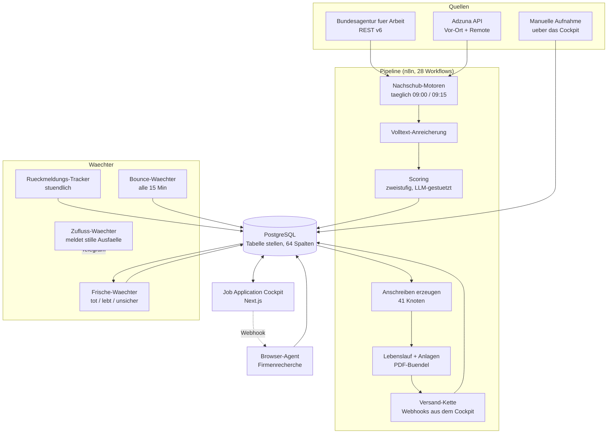

# n8n Job Application Automation

Das Automations-Backend hinter dem [Job Application Cockpit](https://github.com/Oktay-94/job-application-cockpit):
**28 produktive n8n-Workflows**, die Stellenanzeigen einsammeln, bewerten,
Anschreiben erzeugen, den Versand vorbereiten und eingehende Antworten
zuordnen — täglich, unbeaufsichtigt, seit Juni 2026 im Dauerbetrieb auf
eigener Hardware.

Dieses Repository ist die **technische Dokumentation** des Systems. Es enthält
bewusst keine Workflow-Exporte, keine Zugangsdaten und keine Echtdaten —
siehe [Was hier nicht liegt](#was-hier-nicht-liegt).

## Das Problem

Eine ernsthafte Bewerbungsphase ist Fließbandarbeit: Anzeigen suchen, aussieben,
Anschreiben tippen, Versand nachhalten, Antworten zuordnen, tote Anzeigen
erkennen. Bei mehreren tausend Anzeigen im Bestand skaliert Handarbeit nicht.

Die Lösung ist eine Pipeline, in der jeder Schritt einen eigenen Workflow hat,
jeder Workflow einen einzigen Zweck und jeder Zustandsübergang in genau einer
PostgreSQL-Tabelle sichtbar wird.

## Architektur

Die Datenbank ist die einzige Wahrheit. Kein Workflow ruft einen anderen über
geteilten Zustand auf; alles läuft über Spalten in `stellen`. Das macht jeden
Schritt einzeln nachvollziehbar und jeden Ausfall lokal.

## Die 28 Workflows

Eine vollständige Beschreibung mit Auslösern und Knotenzahlen steht in
[`docs/workflows.md`](docs/workflows.md).

| Gruppe | Anzahl | Zweck |
|---|---|---|
| Bewerbungs-Kette | 7 | Anschreiben erzeugen, Anlagen bündeln, Versand |
| Nachschub und Bewertung | 6 | Anzeigen holen, anreichern, zweistufig bewerten |
| Wächter | 5 | Frische, Rückmeldungen, Bounces, Zufluss |
| Dokumenten-Pipeline | 9 | OCR, Vektorisierung, Faktenpflege, Fristen |
| Chat | 1 | Fragen an den eigenen Dokumentenbestand |

## Ausgewählte technische Entscheidungen

### Aktive Workflows werden nie direkt bearbeitet

Ein laufender Workflow, der mitten im Umbau feuert, schreibt halbfertige Logik
in Produktivdaten. Jede Änderung folgt deshalb einem festen Muster:

1. Aktiven Workflow duplizieren, Kopie sofort speichern
2. Umbau ausschließlich auf der **inaktiven** Kopie
3. Testfälle im Editor, jeder mit erwartetem Ergebnis vor dem Lauf
4. Tausch: Original deaktivieren → Kopie aktivieren → alle Aufrufer umhängen
5. Nachweis, dass `versionId == activeVersionId` — sonst ist nur ein Entwurf live
6. Das Original bleibt als benannte Rückfallebene erhalten, deaktiviert

Ohne Schritt 5 sieht die Oberfläche „veröffentlicht" aus, während weiterhin
die alte Fassung feuert. Das ist in n8n kein Fehler, sondern zwei getrennte
Zustände — und der Unterschied kostete mich einmal einen halben Abend.

### `splitInBatches` bricht nach der ersten Runde ab

Ein Postgres-Knoten ohne Rückgabe liefert bei leerem Ergebnis kein Item.
Die Schleife bekommt nichts und beendet sich nach einer Runde — ohne Fehler,
mit grünem Haken. Jeder schreibende Postgres-Knoten in einer Schleife braucht
deshalb `alwaysOutputData: true` **und** eine `RETURNING`-Klausel.

### „success" ist kein Gesundheitsmaß

Die Bundesagentur schaltete ihren `v4`-Endpunkt ab. Alle zehn Such-URLs
lieferten HTTP 403. Weil die HTTP-Knoten auf `continueRegularOutput` standen,
meldete der Nachschub-Motor **22 Tage lang** `success` — und schrieb dabei
keine einzige Zeile. Die Ausführungsgröße blieb konstant bei rund 10 KB.

Zwei Konsequenzen:

- **Der Zufluss-Wächter.** Er misst je Quelle die Zugänge der letzten 48 Stunden
  und meldet Stille per Telegram. Entscheidend ist eine feste `VALUES`-Liste
  beider Quellen statt `GROUP BY quelle`: eine Quelle mit null Zugängen käme
  in einer Gruppierung gar nicht vor — der Wächter schwiege genau dann, wenn
  es brennt.
- **Gesundheit wird an der Datenschicht gemessen**, nie am Ausführungsstatus:
  Zeilenzahlen, Zeitstempel, tatsächlich geschriebene Werte.

## Betriebsdisziplin

Siehe [`docs/betriebsdisziplin.md`](docs/betriebsdisziplin.md) — Messpflicht,
Positivkontrollen, Secret- und PII-Scan vor jedem Push, und ein Katalog von
über 240 dokumentierten Stolpersteinen aus dem Realbetrieb.

## Stack

n8n v2 (selbst gehostet, ohne Docker) · PostgreSQL 16 · Next.js 16 /
TypeScript · Python (Browser-Agent) · Anthropic API (Scoring und Anschreiben) ·
Telegram (Alarmierung) · Tailscale (Fernzugriff)

## Was hier nicht liegt

Bewusst ausgeschlossen, weil dieses Repository öffentlich ist:

- **Workflow-JSON** — enthält Credential-Referenzen, Webhook-Pfade und Prompts
  mit persönlichen Profildaten
- **Zugangsdaten jeder Art** — API-Schlüssel, Datenbank-URLs, Postfachdaten
- **Echtdaten** — Stellenanzeigen, Firmennamen, Ansprechpartner, Anschreiben
- **Laufprotokolle** — die Protokolle der Agentenläufe tragen Kontaktdaten aus
  Stellenanzeigen und sind im Arbeits-Repository per `.gitignore` ausgenommen

Was hier steht, ist Architektur, Entscheidungen und Betriebswissen.

## Verwandte Projekte

- [job-application-cockpit](https://github.com/Oktay-94/job-application-cockpit) — die Oberfläche zu dieser Pipeline
- [document-cockpit](https://github.com/Oktay-94/document-cockpit) — Dokumentenverwaltung mit semantischer Suche

## Lizenz

MIT — siehe [LICENSE](LICENSE).
